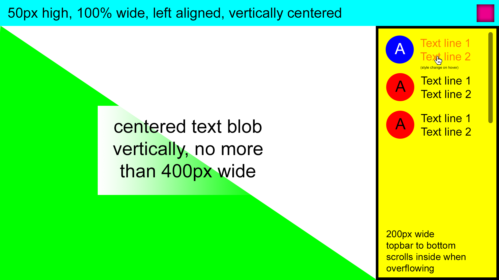

# The Challenge

Replicate this image using only CSS.

You can check out where I'm at so far by clicking [here](https://mrmicrowaveoven.github.io/CSSPractice/)

## Fine Print

The design is not quite to scale FWIW. You should attempt to achieve the following goals:
* Produce a single HTML file with no external dependencies
* Don't use any third-party libraries for styling / layout
* Try to produce DRY and clean CSS
* Try to replicate the design as closely as possible (but the green triangle doesn't need to be perfect; that part might be tricky)
* Don't use images or JS
* You shouldn't use z-index anywhere
* All of the text shown in the image should be included in the final page, ignoring the descriptive text in parenthesis
* The page should be supported by at least 90% of current desktop web browsers (see caniuse.com, for example).
* The page should be fluid and work reasonably well when resized or zoomed (within parameters for a desktop browser) without needing media queries
